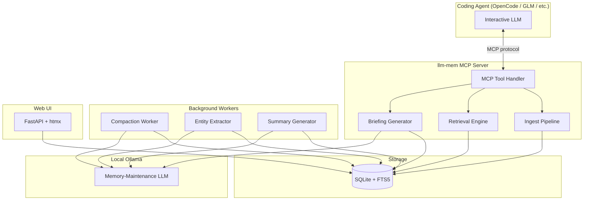
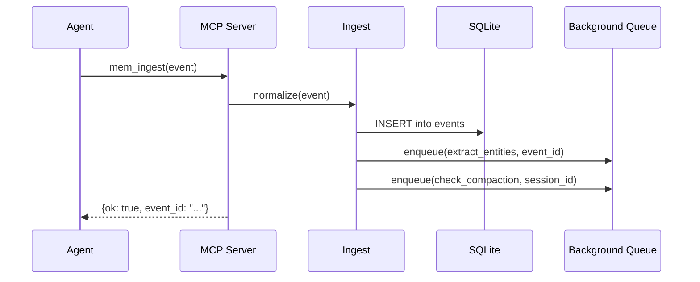
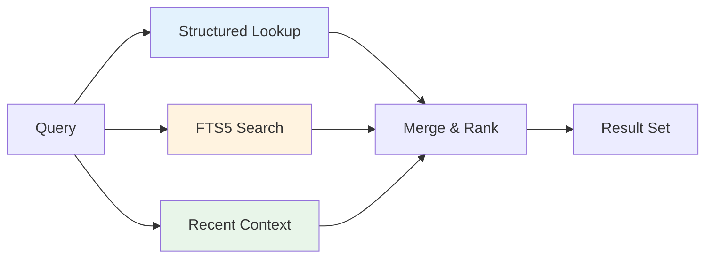
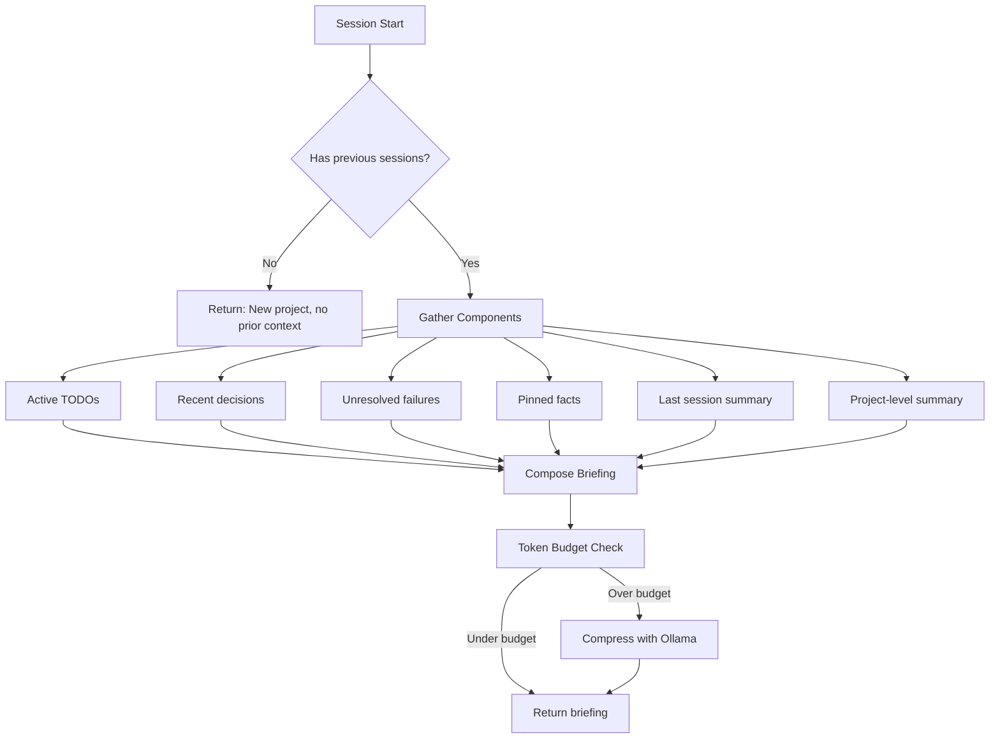
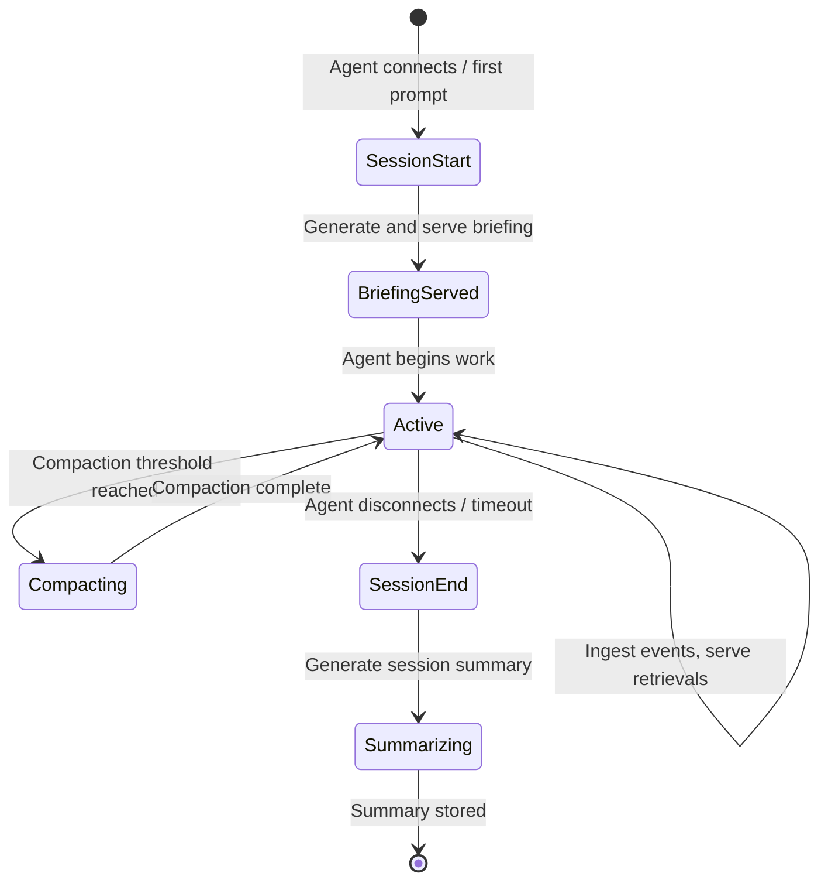

# Architecture

## System overview

llm-mem is composed of five subsystems that communicate through a shared SQLite database and an internal event bus.



## Subsystem descriptions

### 1. MCP Server (`src/llm_mem/mcp/`)

The external interface. Exposes MCP tools, resources, and prompts that coding agents call. Runs as a subprocess launched by OpenCode (stdio transport) or as a standalone HTTP server (SSE transport for future adapters).

Responsibilities:
- Accept `mem_ingest` calls with raw events (prompts, responses, tool calls, file changes)
- Handle `mem_search` queries with keyword + structured filters
- Serve `mem_get_briefing` for session startup
- Expose resources like `memory://briefing` and `memory://tasks`

The MCP server is stateless — all state lives in SQLite.

### 2. Ingest Pipeline (`src/llm_mem/core/ingest.py`)

Receives raw events and normalizes them into the database.

Event flow:


Event types:
| Type | Source | Contains |
|---|---|---|
| `prompt` | User message | Raw text, timestamp |
| `response` | LLM response | Raw text, model used, token count |
| `tool_call` | Agent tool use | Tool name, args, result summary |
| `file_change` | File watcher / agent | File path, diff summary, change type |
| `decision` | Extracted | What was decided and why |
| `failure` | Extracted | What failed, error, resolution |
| `todo` | Extracted | Task description, status, priority |
| `discovery` | Extracted | Notable finding or insight |
| `fact` | Extracted / User-pinned | Durable project fact |

Raw events (`prompt`, `response`, `tool_call`, `file_change`) are ingested directly. Structured types (`decision`, `failure`, `todo`, `discovery`, `fact`) are extracted asynchronously by the entity extractor.

### 3. Retrieval Engine (`src/llm_mem/core/retrieval.py`)

Combines three retrieval strategies in a ranked pipeline:



**Strategy 1: Structured lookup** (highest priority)
- Query by type: decisions, TODOs, facts, failures
- Filter by session, date range, entity, project
- Used for "what decisions did we make about X?"

**Strategy 2: FTS5 full-text search**
- SQLite FTS5 index across event content and summaries
- BM25 ranking
- Used for keyword-based retrieval

**Strategy 3: Recent context window**
- Last N events from the current session
- Last N events from the most recent prior session
- Always included in briefings to maintain continuity

**Future Strategy 4 (v2): Semantic search**
- Optional vector embeddings stored alongside structured data
- Cosine similarity search for "things like X"
- Pluggable backend: local (sentence-transformers) or API

Results from all strategies are merged, deduplicated by event ID, and ranked by a weighted score combining recency, relevance, and type priority.

### 4. Background Workers (`src/llm_mem/core/workers.py`)

Background jobs that maintain memory quality. These run asynchronously and use the local Ollama model — never the interactive coding model.

#### Entity Extractor
Processes raw events and extracts structured entities (decisions, TODOs, facts, failures, discoveries). Runs after each batch of ingested events.

Prompt pattern:
```
Given this coding session exchange, extract:
- Decisions made (what and why)
- TODOs mentioned (task, priority, status)
- Facts established (durable project knowledge)
- Failures encountered (what failed, resolution if any)
- Discoveries (notable insights)

Respond in JSON.
```

#### Summary Generator
Produces session summaries at configurable intervals (default: every 50 events or on session end).

Levels:
1. **Event-level**: Individual event → 1-2 sentence summary
2. **Chunk-level**: Group of 10-20 events → paragraph summary
3. **Session-level**: Entire session → structured summary with key outcomes
4. **Cross-session**: Multiple sessions → project-level summary

#### Compaction Worker
Manages memory growth by compressing old, low-value memories.

Compaction strategy:
```
Age < 1 day:     Keep all raw events + summaries
Age 1-7 days:    Keep summaries + pinned events + structured entities
Age 7-30 days:   Keep session summaries + structured entities
Age > 30 days:   Keep cross-session summaries + pinned items + facts
```

Compaction never deletes pinned events, active TODOs, or facts. Compaction thresholds are configurable.

### 5. Briefing Generator (`src/llm_mem/core/briefing.py`)

Produces the startup context block served at the beginning of each coding session.

Briefing assembly:


The briefing has a configurable token budget (default: 2000 tokens). If assembled components exceed the budget, the Ollama model compresses them while preserving high-priority items (active TODOs, unresolved failures, recent decisions).

Briefing format:
```markdown
## Session Briefing — [project name]

### Active TODOs
- [ ] Implement rate limiting on /api/query (priority: high)
- [ ] Add pagination tests (priority: medium)

### Recent Decisions
- Chose cursor-based pagination over offset (2 sessions ago)
- Using Redis for session cache, not in-process (last session)

### Unresolved Issues
- Flaky test in test_concurrent_writes — intermittent deadlock

### Project Context
[Compressed summary of project state and recent work]
```

## Session lifecycle



A "session" maps to a continuous period of interaction. Session boundaries are detected by:
1. Explicit MCP `session_start` / `session_end` signals
2. Inactivity timeout (configurable, default: 30 minutes)
3. Agent process disconnect

## Separation of LLMs

This is a critical architectural boundary:

| Role | Model | When it runs | Who pays for tokens |
|---|---|---|---|
| **Interactive LLM** | User's choice (Claude, GPT, Qwen, etc.) | During coding session | User's API budget |
| **Memory-maintenance LLM** | Local Ollama (configurable) | Background, async | Free (local compute) |

The memory-maintenance LLM is never in the interactive path. It processes events after they're ingested and produces summaries/extractions that are stored in SQLite. The interactive LLM only sees pre-computed briefings and search results — never raw memory processing.

This means:
- Memory maintenance doesn't add latency to the interactive loop
- You can use a small, fast model for memory work (qwen3:8b, llama3.1:8b)
- The interactive model's token budget is spent only on actual coding work + compact memory context
- If Ollama is temporarily unavailable, ingest still works — extraction and compaction queue up and process when available

## Data flow summary

```
User prompt → Agent → MCP ingest → SQLite (raw event)
                                        ↓
                               Background queue
                                        ↓
                               Ollama extracts entities
                                        ↓
                               SQLite (decisions, TODOs, facts, etc.)
                                        ↓
                               Ollama generates summaries
                                        ↓
                               SQLite (summaries at multiple levels)

Next session start → MCP get_briefing → Retrieval engine
                                              ↓
                                    Assemble from SQLite
                                              ↓
                                    Token budget check
                                              ↓
                                    (Optional) Ollama compress
                                              ↓
                                    Compact briefing → Agent
```
