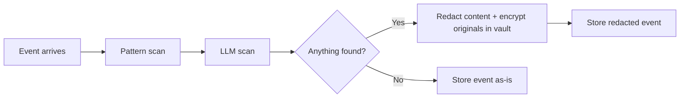

# Sensitive Data Protection

## Threat model

callmem stores everything a coding agent sees — prompts, responses, tool calls, file contents. This inevitably includes sensitive data:

| Category | Examples | How it gets in |
|---|---|---|
| **Secrets** | API keys, tokens, passwords, private keys | `.env` files, config snippets, deployment discussions |
| **Credentials** | Database connection strings, OAuth tokens | Agent reads config, discusses infrastructure |
| **PII** | Names, emails, phone numbers, addresses | User data in test fixtures, discussions about users |
| **Financial** | Credit card numbers, bank accounts | Payment integration work, test data |
| **Infrastructure** | IP addresses, hostnames, paths with usernames | Deployment discussions, error logs |

### What we're protecting against

1. **Database file exposure** — someone gets your `memory.db` (stolen laptop, accidental git push, backup leak)
2. **Briefing and search results leaking secrets** — the startup briefing and search results are injected into the interactive model's context; secrets in memory become secrets in prompts
3. **Web UI displaying secrets** — browser on screen, screen sharing

### What we're NOT protecting against

- A fully compromised local machine (root access = game over regardless)
- The interactive coding LLM seeing secrets in real-time (it's already reading your `.env` — that's its job)
- Perfect recall (some secrets will slip through; this is defense-in-depth)

## Design: Two-layer detection, one storage strategy

### Layer 1: Pattern matching (fast, deterministic, no LLM needed)

Regex + Shannon entropy catches structured secrets at ingest time. This is cheap, runs synchronously, and handles the majority of cases.

**What it catches:** AWS keys, GitHub tokens, OpenAI/Anthropic keys, Stripe keys, private key blocks, JWTs, bearer tokens, connection strings with credentials, credit card numbers (Luhn-validated), email addresses, high-entropy random strings in secret-like contexts.

**What it misses:** Passwords in natural language, custom token formats, names, addresses, contextual PII.

### Layer 2: Local LLM detection (contextual, catches what patterns miss)

The local Ollama model reviews events for sensitive content that regex can't catch. This is the same local model already used for entity extraction — and since it runs on the user's own hardware, there's no privacy concern about feeding it raw content. That's the whole point of local inference.

**What it catches that patterns miss:**
- "The staging password is dolphin42"
- "John Smith's account was overcharged" (PII in context)
- Custom internal token formats
- Sensitive business logic described in natural language

### When each layer runs

Both layers run at ingest time, before the event is persisted to the database:



**Why inline, not async:**
- The data is local. There's no privacy risk in letting the local Ollama model see it.
- If we store first and scan later, there's a window where plaintext secrets sit in the database.
- Ingest latency is acceptable: pattern scan is <1ms, LLM scan is 100ms-1s. The agent doesn't need sub-millisecond ingest.
- Simpler architecture: no "pending scan" state, no race conditions with retrieval returning unscanned events.

**Fallback when Ollama is unavailable:**
If Ollama isn't running, Layer 1 (patterns) still runs. The event is stored with a `scan_status = "pattern_only"` flag. When Ollama becomes available, a background job rescans `pattern_only` events and applies any additional redactions. This is the only async path — and it's a graceful degradation, not the primary flow.

## What happens when sensitive data is detected

### Redaction

Detected values are replaced in the stored event content with a token:

```
Original: "Set the API key to sk-proj-abc123def456ghi789jkl012mno345"
Stored:   "Set the API key to [REDACTED:secret:a1b2c3]"
```

Token format: `[REDACTED:{category}:{vault_id}]`
- `category`: `secret`, `credential`, `pii`, `financial`, `infra`
- `vault_id`: Short reference to the encrypted vault entry

The redacted text is still useful — an agent reading "Set the API key to [REDACTED:secret:a1b2c3]" understands the decision that was made, just not the actual key value. This is the right tradeoff for memory.

### Encrypted vault

Original values are stored encrypted in a `vault` table:

```sql
CREATE TABLE vault (
    id            TEXT PRIMARY KEY,
    project_id    TEXT NOT NULL REFERENCES projects(id),
    category      TEXT NOT NULL,       -- secret, credential, pii, financial, infra
    detector      TEXT NOT NULL,       -- pattern, llm
    pattern_name  TEXT,                -- Which pattern matched (e.g., "aws_key")
    ciphertext    BLOB NOT NULL,       -- Fernet-encrypted original value
    created_at    TEXT NOT NULL,
    event_id      TEXT REFERENCES events(id),
    reviewed      INTEGER DEFAULT 0,   -- 1 = human reviewed
    false_positive INTEGER DEFAULT 0   -- 1 = marked as not sensitive → event unredacted
);
CREATE INDEX idx_vault_project ON vault(project_id, created_at DESC);
CREATE INDEX idx_vault_event ON vault(event_id);
```

### Encryption

Fernet (AES-128-CBC + HMAC) via Python's `cryptography` library.

**Key management — two modes:**

| Mode | How it works | Protects against |
|---|---|---|
| **`auto`** (default) | Random key generated on init, stored in `.callmem/vault.key` | Database file theft (without the key file) |
| **`passphrase`** | Key derived from `CALLMEM_VAULT_PASSPHRASE` env var via scrypt | Database + key file theft (without the passphrase) |

Default is `auto` because it requires zero configuration. If your `memory.db` file is backed up to cloud or stored somewhere shared, set a passphrase.

## Pattern library

Built-in patterns, shipped with callmem:

```python
PATTERNS = {
    # Cloud providers
    "aws_access_key":   r"AKIA[0-9A-Z]{16}",
    "aws_secret_key":   r"(?i)aws_secret_access_key\s*[=:]\s*[A-Za-z0-9/+=]{40}",
    "gcp_service_key":  r'"type"\s*:\s*"service_account"',

    # Code hosting
    "github_token":     r"(ghp|gho|ghu|ghs|ghr)_[A-Za-z0-9_]{36,}",
    "github_pat":       r"github_pat_[A-Za-z0-9_]{82}",
    "gitlab_token":     r"glpat-[A-Za-z0-9\-]{20,}",

    # LLM providers
    "openai_key":       r"sk-[A-Za-z0-9]{20,}",
    "anthropic_key":    r"sk-ant-[A-Za-z0-9\-]{90,}",

    # Payment / SaaS
    "stripe_key":       r"(sk|pk|rk)_(test|live)_[A-Za-z0-9]{24,}",
    "sendgrid_key":     r"SG\.[A-Za-z0-9_\-]{22}\.[A-Za-z0-9_\-]{43}",

    # Generic secrets
    "private_key":      r"-----BEGIN (RSA |EC |OPENSSH |DSA |ED25519 )?PRIVATE KEY-----",
    "jwt":              r"eyJ[A-Za-z0-9_-]{10,}\.[A-Za-z0-9_-]{10,}\.[A-Za-z0-9_-]{10,}",
    "bearer_token":     r"(?i)(bearer|token)\s+[A-Za-z0-9_\-.~+/]{20,}",
    "basic_auth":       r"(?i)basic\s+[A-Za-z0-9+/=]{20,}",

    # Connection strings
    "db_connection":    r"(?i)(postgres|mysql|mongodb|redis|amqp)://[^\s]+:[^\s]+@[^\s]+",
    "url_with_creds":   r"https?://[^\s:]+:[^\s@]+@[^\s]+",

    # Financial
    "credit_card":      r"\b(?:4[0-9]{12}(?:[0-9]{3})?|5[1-5][0-9]{14}|3[47][0-9]{13})\b",

    # PII (basic)
    "email":            r"[a-zA-Z0-9._%+\-]+@[a-zA-Z0-9.\-]+\.[a-zA-Z]{2,}",
    "ipv4_address":     r"\b(?:(?:25[0-5]|2[0-4][0-9]|[01]?[0-9][0-9]?)\.){3}(?:25[0-5]|2[0-4][0-9]|[01]?[0-9][0-9]?)\b",
}
```

### Entropy detection

For strings that don't match a known pattern but look like random tokens:

```python
def looks_like_secret(token: str, context: str) -> bool:
    """High-entropy string in a secret-like context."""
    if len(token) < 20:
        return False
    if shannon_entropy(token) < 4.0:
        return False
    # Only flag if preceded by a secret-like label
    secret_contexts = ["key", "token", "secret", "password", "api_key", "apikey",
                       "auth", "credential", "private"]
    return any(ctx in context.lower() for ctx in secret_contexts)
```

### LLM detection prompt

```python
SENSITIVE_SCAN_PROMPT = """Review this text from a coding session for sensitive data.

Text:
{text}

Identify any of the following:
1. Passwords or passphrases (e.g., "the password is hunter2")
2. API keys or tokens not matching common patterns
3. Personal information: real person names with identifying context, physical addresses, phone numbers
4. Financial data: account numbers, routing numbers

Do NOT flag:
- Variable names like `password` or `api_key` (only flag actual values)
- Test/example data that is clearly fake (e.g., "test@example.com", "John Doe")
- Localhost addresses, RFC 5737 documentation IPs (192.0.2.x, 198.51.100.x, 203.0.113.x)

Respond in JSON:
{{
  "findings": [
    {{
      "type": "password|api_key|pii|financial",
      "value": "the exact sensitive string",
      "start": character_offset,
      "end": character_offset,
      "confidence": 0.0-1.0
    }}
  ]
}}

Empty findings if nothing sensitive: {{"findings": []}}"""
```

## Integration with existing subsystems

### Ingest pipeline (modified)

```python
def ingest(event: EventInput) -> Event:
    content = event.content

    # Layer 1: pattern scan
    content, vault_entries_1 = pattern_scanner.scan_and_redact(content)

    # Layer 2: LLM scan (if Ollama available)
    if ollama.is_available():
        content, vault_entries_2 = llm_scanner.scan_and_redact(content)
        scan_status = "full"
    else:
        vault_entries_2 = []
        scan_status = "pattern_only"

    # Store redacted event
    event.content = content
    event.metadata["scan_status"] = scan_status
    stored = repository.insert_event(event)

    # Store encrypted originals
    for entry in vault_entries_1 + vault_entries_2:
        entry.event_id = stored.id
        crypto.encrypt_and_store(entry)

    return stored
```

### Retrieval, briefing, and entity extraction

All downstream consumers see redacted content. The Ollama model doing entity extraction, summarization, and briefing generation receives text with `[REDACTED:...]` tokens, never the original values. This is a natural consequence of redacting at ingest.

### Web UI — vault viewer

The vault page in the web UI shows:
- List of detections: category, detector, date, event link
- Redacted preview of surrounding context
- "Reveal" button: decrypts and shows original (requires vault key loaded)
- "False positive" button: un-redacts the event, flags the vault entry
- Bulk re-scan: re-run detection on historical events (useful when new patterns are added)

## Configuration

```toml
[redaction]
enabled = true
pattern_scan = true
llm_scan = true
llm_scan_confidence = 0.7         # Min confidence for LLM-detected items

# Categories to detect
detect_secrets = true              # API keys, tokens, private keys
detect_credentials = true          # Passwords, connection strings
detect_pii = true                  # Emails, phone numbers (names only via LLM)
detect_financial = true            # Credit cards, account numbers
detect_infrastructure = false      # IPs, hostnames — off by default (noisy)

# Entropy
entropy_enabled = true
entropy_threshold = 4.5
entropy_min_length = 20

# Allowlist — never redact these
allowlist = [
    "test@example.com",
    "127.0.0.1",
    "localhost",
]

# Custom patterns (added to built-in library)
# custom_patterns = { "my_internal_token" = "MYCO-[A-Z0-9]{32}" }

[vault]
mode = "auto"                      # "auto" or "passphrase"
# passphrase read from CALLMEM_VAULT_PASSPHRASE env var when mode = "passphrase"
```

## False positive handling

1. **Mark false positive** in UI or via `mem_vault_review` MCP tool → event content is un-redacted, vault entry flagged
2. **Allowlist** in config for known-safe values
3. **Per-category toggles** to disable noisy detection types
4. **Confidence threshold** for LLM detections — only act on high-confidence findings

## What this does NOT include

- **Full database encryption** (SQLCipher): Overkill. Field-level encryption of sensitive values is sufficient and simpler.
- **Redaction of the interactive model's context**: Out of scope. The coding agent already sees secrets in real-time — callmem protects the stored record, not the live session.
- **Guaranteed perfect detection**: Some secrets will slip through. The primary defense is still "don't commit secrets to your codebase."
